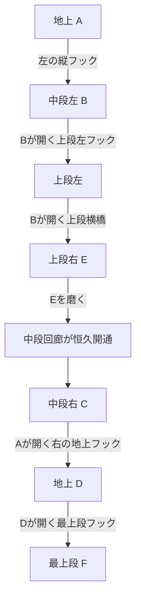

# 四階建て・星あかり塔 — 窓ふき論理パズル v0.3

## 今回の受け入れ条件

- 既存の最初の二城壁は保ち、最後だけ四階・六窓にする。
- 1本のハシゴを縦置きと横掛けに使い回し、置き直しの順番が解法の一部になる。
- 磨いたEの窓が中段の常設回廊を開き、以後はその階の切れ目を歩いて越えられる。
- E → C → D → F の雨戸とフックの条件を盤面上に表示し、解法そのものはマップに表示しない。
- どの合法状態からも、ハシゴを回収・再配置してクリアまで戻れる。
- 最少設置回数を独立探索で照合し、720×1280と360×800のマウス／タッチで実画面を検証する。
- 最上階の窓に、絵本調の新住人「星見の蛾」を表示する。
- 同じ高さにあるフックの選択範囲を重ねず、最上段の左右端へ分けて配置する。

## 四階の盤面

下から順に、地上 A・D、中段 B・C、上段 E、最上段 F を置く。最後の城壁だけを縦に増築するため、従来の二枚の城壁と最初の五窓は変わらない。六窓は16窓の旅の最後の一枚となる。

| 窓 | 場所 | 窓を磨くと起きること |
| --- | --- | --- |
| A | 地上 | 左右の地上フックを開く |
| D | 地上 | Fの雨戸と最上段のフックを開く。Cを磨くまで雨戸は閉じたまま |
| B | 中段・左 | 上段左のフック、中段の橋、上段の橋を開く |
| C | 中段・右 | 右側の上段フックとDの雨戸を開く。Eを磨くまで雨戸は閉じたまま |
| E | 上段・右 | Cの雨戸を開き、中段左右を結ぶ石造りの常設回廊を開く |
| F | 最上段 | 最後の窓。Dが開くまで雨戸は閉じたまま |

ハシゴは縦にも横にも同じ一本を使う。上段の横橋でEに届いたら、橋を渡り直して縦の道へ掛け替える。Eを磨いたあとは、橋のない中段が歩ける回廊に変わる。横橋をいつ回収するか、上下の移動に使ったハシゴを帰路として残すかが、設置回数を決める。

図は鍵の依存と主な移動先だけを示す。実際のマップは各窓とフックの文字を対応づけ、プレイヤーには正解の設置順を教えない。

## 最少設置数

| 道具 | 最少設置 | 使いどころ |
| --- | ---: | --- |
| 長柄なし | 7 | Bで上段に登る → 横橋でE → 同じ橋で戻る → 中段へ下りる → E開通後Cへ歩く → Dへ下り、同じ縦梯子で上段へ戻る → Fへ登る |
| 長柄あり | 5 | 中段の橋で右へ渡ってEを下から磨く → 中段回廊を開ける → Dの上下移動に同じ梯子を往復利用 → 右側の縦フック二本でFへ |

最少数は `<Godot> --headless --debug --path . --script tests/test_route_solver.gd` の独立グラフ探索で検証する。歩行・清掃・既設梯子の横断と回収は設置数に含めない。各道具の選択順でランの総記録は別にする。

## ゲーム内の見せ方

- 窓の雨戸には、開ける窓の文字を `E → C` のように表示する。
- ロック中のフックには、鍵となる窓の文字を出す。
- 仕掛けマップは鍵とフックの関係、設置目標回数、Eの常設回廊だけを説明する。
- 常設回廊はEを磨いた瞬間に石色と金の継ぎ目で見せ、ハシゴが不要になったことを画面で伝える。
- 「星見の蛾」はFの窓の中に置く。磨き上がった瞬間に清掃の到達点と住人の発見を重ねる。
- 四階を一画面に収め、ルートを覚えるためのカメラ移動を要求しない。
- 最上階左右のフックは中段フックから88px以上離し、タップ半径44pxが重ならないようにする。足場もフックまで延長して、置き場所と立てる場所を一致させる。

## 検証

- `tests/test_route_solver.gd`：窓・階・領域・梯子位置・長柄の消費を抽象化。最終塔は長柄なし7回、あり5回。合法な全到達状態からクリアへ戻れることを確認。
- `tests/test_run.gd`：最終塔の両解法を、窓清掃・歩行・梯子設置・登降の実際の状態モデルで通す。E清掃後に中段を歩けることと、既設の横梯子は橋として回収できることも確認。
- `tests/test_run.gd`と`tests/test_ui_runtime.gd`：複数seedでフック範囲の間隔を調べ、画面入力が最上階の左右フックへ正しく設置することを確認。
- `tools/playtest-run-browser.js`：実際のマウス／CDPタッチで三城壁をクリアし、各壁の設置目標とコンソール診断を照合する。

人が見て最適解に気づくタイミングや、最初のプレイで難度が理不尽でないかは自動探索では評価できない。初見の短い試遊で、Eの回廊を発見した時に「橋の使い方が変わった」と伝わるかを確認する。
