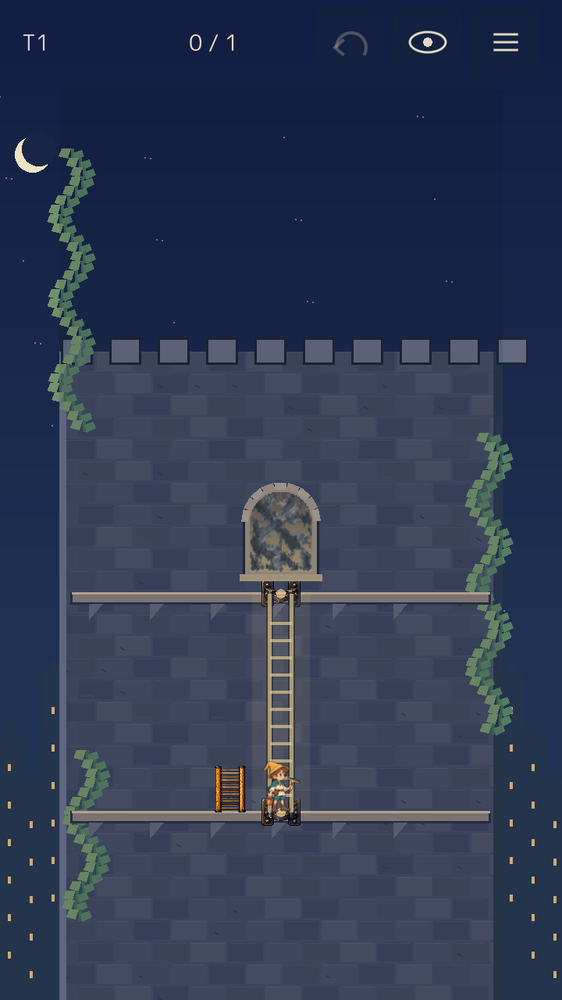
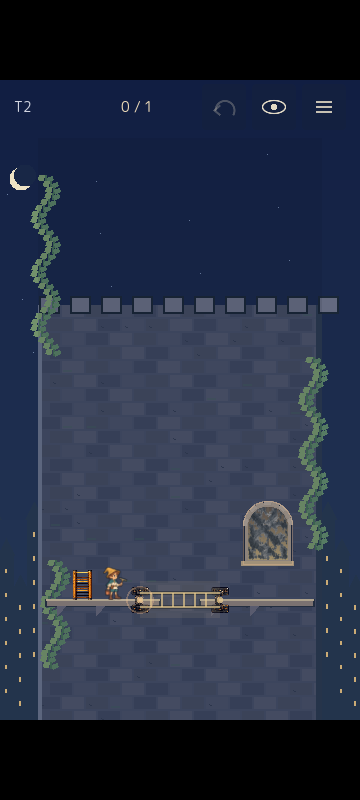
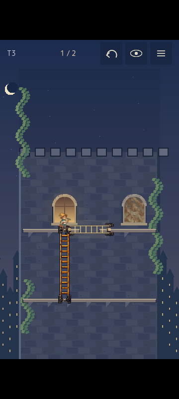
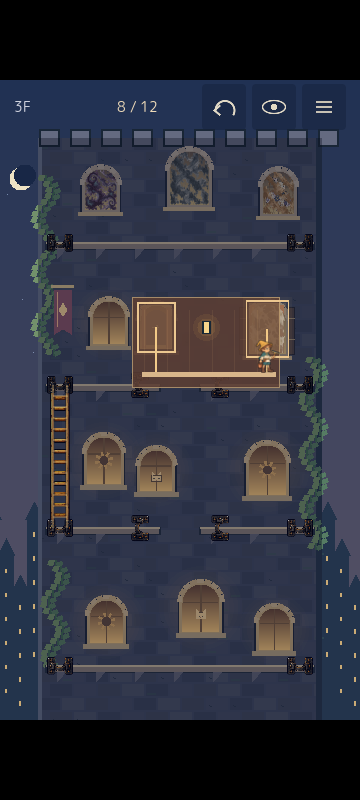

# UX PASS v0.2 — implementation and verification

2026-09-30. Follow-up to [Issue #4](https://github.com/madowaku/madohuki-yuusya/issues/4) in [Draft PR #3](https://github.com/madowaku/madohuki-yuusya/pull/3).

The implemented rule is **操作方法を推理させない。解法だけを推理させる。** Human first-use acceptance remains open; automated play verifies operation and puzzle consistency, not discoverability.

## Implemented behavior

- Start opens T1 vertical, T2 bridge, T3 reposition, then the existing twelve-window tower. These sparse boards have no instruction paragraphs, shutters or interiors. A short CLEAN payoff precedes each advance. Retry keeps the current board; Undo cancels a pending advance.
- The visible carried ladder beside the hero and the installed ladder shaft are the ladder controls. Tapping the hero body does not enter placement mode. Normal tower input has no Retrieve button or E retrieval shortcut.
- Placement and optional Help show full vertical/horizontal ghost ladders. Their entire bodies have at least 88 design-pixel coverage, equivalent to 44 CSS pixels at 360px width. Every nonempty legal transport plan is shown, including destinations reached by first climbing the existing ladder. Expanded targets at shared landings resolve to the nearest ladder segment, then its center. Window targets take precedence where padding meets glass.
- A destination window or ledge queues walking, climbing and crossing along the installed route. Dirty glass can be erased only after actual arrival. The current ladder stays in place while the player selects or cancels placement mode; choosing a new ghost performs retrieval and transport as one placement decision.
- Unreachable dirty windows respond with an outline, a brief trace ending at the first missing connection and a one-shot ladder cue. No recommendation, solution order or route length is displayed.
- The eye icon toggles available floor regions, reachable dirty windows and legal ladder destinations. An idle interval pulses the ladder and reachable dirty panes once after five seconds. Menu can disable idle cues; the preference persists.
- Physical iron sockets replace floating hook-only interaction marks. Ladder selection gently dims the board; ghosts fade in over 150ms. A selected destination brightens and previews the route being removed. Reduced motion retains static feedback.
- Undo retains polished glass and restores route choices, latch state and gallery decisions. The original same-screen interior/latch/exit route and three-wall mode remain available.

## Generated art

`assets/generated/ladder_brackets_v02.png` is a transparent ladder/bracket atlas generated with the **built-in image_gen** tool and copied into the repository. The tool does not expose a model selector/version, so this receipt does not claim a specific Images 2.5 model. Original alpha is preserved; gameplay draws atlas regions without changing the source image. Prompts and regions are recorded in [the asset receipt](../assets/generated/ux_props_v02_prompt.json) and `assets/generated/production_prompts.json`. Credits and the packaged manifest include the new asset.

## Verification

`python tools/verify.py --godot <Godot 4.7 console executable>` passes with no Godot warnings or runtime errors. The wrapper records timeouts as failures and writes a fresh summary, rather than leaving a previous run's summary in place.

| Check | Result |
| --- | --- |
| Original stage | 35 assertions, 0 failures |
| Generated art and dirt composition | 103 checks, 0 failures |
| Original three-wall run | 1,592 checks, 0 failures |
| Original route solver | 849 reachable abstract states, 0 failures |
| Original UI runtime | 3,808 checks, 0 failures |
| Twelve-window tower | 1,087 checks, 0 failures |
| Teaching boards | 44 checks, 0 failures |
| Direct controls, Help, feedback, cues and tutorial flow | 35 checks, 0 failures |
| Independent tower solver | Minimum 4 placements; all 10,084 reachable states can finish |
| Independent teaching-board solver | T1 minimum 1, T2 minimum 1, T3 minimum 2; all 4/4, 4/4 and 8/8 states recoverable |
| Godot resource/scene validation | 0 errors, 0 parse errors, 0 warnings |
| Native title/play/menu layout scenarios | 720×1280 and 360×800; 0 UI findings |
| Actual release Web play | Mouse 720×1280 and CDP touch 360×800; T1→T2→T3→12 windows; 4 tower placements; 0 browser warnings/errors |

The browser harness uses real pointer events and read-only `window.windowHero.state`, with no gameplay mutation commands. It checks full ghost-body selection, automatic destination movement, unreachable feedback, Help, placement cancellation, retained glass after Undo, same-ladder repositioning, interior entry, latch Undo/reopening, exit and full completion. Release exports omit `windowHeroCommand`.

Reproduce with Playwright CLI `run-code --filename tools/playtest-ux-browser.js` from the title screen. At 360px width it uses actual CDP touch events. Logs and captures are under `output/playwright/ux-v02-*`; native reports are under `output/verification/`.

## Captured release build

## Remaining human gate

PR #3 stays Draft. Observe a fresh player without explaining the controls: whether they touch the ladder, interpret a ghost as a choice, discover the horizontal use after T2, reposition without searching for Retrieve after T3, and pause on the tower to reason about routes. Automated completion cannot answer these questions.

Tap-then-select is the canonical interaction. Optional direct drag of the ladder has not been added; dragging on glass remains reserved for cleaning. Touch verification uses a real browser touch pipeline at 360×800, rather than a physical phone. The portrait canvas keeps its existing aspect ratio and letterboxes within 360×800; targets remain at least 44 CSS pixels. No new puzzle mechanics, final floor or ending were added in this pass.

The local release is served at `http://127.0.0.1:8066/`. The regenerated submission archive is `build/window-hero-itch.zip` (ignored by Git); its current checksum is recorded in the local packaging output.
