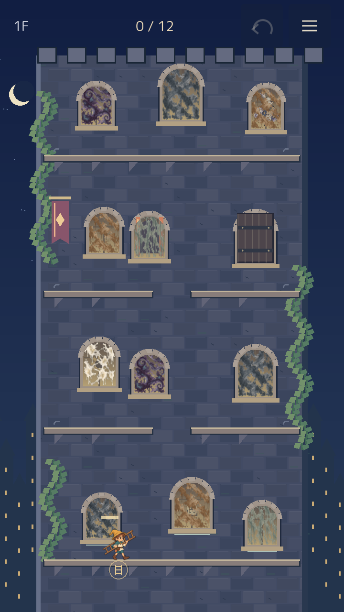
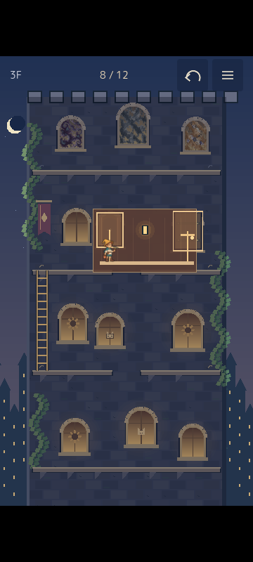
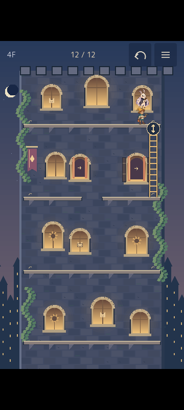

# VISUAL / UX PASS v0.1 — implementation and verification

2026-09-30 · [Issue #2](https://github.com/madowaku/madohuki-yuusya/issues/2)

The default game is now **THE LANTERN TOWER / 灯りをつなぐ塔**: one authored board with twelve required windows, four elevations, two exterior gaps, one interior connection and one inner shutter. One ladder is reused vertically, horizontally and across the interior detour. The minimum is **four placements**. The original three-wall run remains accessible through Menu and the result panel.

The implementation follows [VISUAL / UX PASS v0.1](VISUAL_UX_PASS_v0.1.md). Automatic and visual checks pass; the first-time human AHA questions remain open. This is an implemented pass awaiting human feel review, not a claim that those questions have been answered.

## PASS receipts

| Pass | Implemented behavior | Evidence |
| --- | --- | --- |
| A | Twelve small, arched windows with staggered heights and asymmetric groupings. Every window target covers its glass and is at least 88×88 design pixels. Window/hook targets on the same landing are disjoint. | Native target assertions; actual 360×800 CDP touch; screenshots below. |
| B | Tap hero → select a legal destination. Automatic approach, traversal to the existing ladder, retrieval, transport and placement are one Undo transaction. The old ladder stays until selected. Candidates include hooks across the current bridge. Removing a route is previewed in muted red. Tapping the installed arrow crosses the ladder. | Native transaction/pause/cancellation checks; both Web runs move the bridge back across itself before retrieval and later transport via the interior. |
| C | A polished open window admits the hero. The same exterior remains visible while the current chamber is revealed. Tap the latch to open the shutter, then tap the open window to exit. The exterior ladder stays in place. Outside taps only rattle the shutter. | Native open/Undo/reopen assertions; both Web runs enter, open, Undo, reopen and exit without changing gameplay state through a debug hook. |
| D | One HUD row: floor, required-window count, Undo, Menu. No regular retrieve button, tool inventory or persistent instructions. Undo handles placement/transport, traversal, latch and gallery activation while retaining polished glass. The result can be undone and completed again by returning to the crown. | Japanese/English native layout assertions at both sizes; two skill `ui_report` scenarios; real Web Undo. |
| E | Blue-purple stone, warm revealed rooms, generated hero/dirt/moth artwork. CLEAN flash and sparkle last 0.65s; shutter rattles 0.35s, opens 0.35s and emits warm light; new gallery seam lights for 0.7s; placed ladder settles within 0.18s. Reduced motion keeps static state feedback. Hidden arch corners contain no dirt. | Rendered Web inspection; resource and warning validation; ordinary four-zigzag cleaning completes every window. |
| F | Independent 0/1 BFS, original Godot suites, tower model/UI tests, real release Web mouse/touch playthroughs and checked itch ZIP. | Results below. Human first-use AHA and physical-device checks remain open. |

## Verification

| Check | Result |
| --- | --- |
| Original stage model | 35 assertions, 0 failures |
| Original art integration | 100 checks, 0 failures |
| Original seeded run | 1,592 checks, 0 failures |
| Original route solver | 849 states, 0 failures; existing placement goals preserved |
| Original run UI | 3,808 checks, 0 failures |
| Tower transactions, hit targets and UI | 1,033 checks, 0 failures |
| Independent tower solver | Minimum 4 placements; **10,084 / 10,084** reachable legal terminal-mode states can finish |
| Whole-project load/scene validation and debug boot | 0 errors, 0 warnings |
| Skill UI scenarios, 720×1280 and 360×800 | `ok: true`; no overlap, offscreen or zero-size findings |
| Release Web mouse, 720×1280 | 12 / 12 windows; 4 placements; old bridge traversed before retrieval; indoor transport; 0 browser warnings/errors |
| Release Web touch, 360×800 | 12 / 12 windows; 4 placements; actual CDP touch gestures and taps; 0 browser warnings/errors |
| Release debug boundary | Read-only `window.windowHero.state` available; `windowHeroCommand` undefined |
| itch archive | ZIP integrity and required files/licenses/checksums pass; `build/window-hero-itch.zip` |

Solver states contain clean bits, exterior/interior region, ladder location, shutter state and gallery state. Placement costs one; other actions cost zero. Explicit retrieval/crossing edges independently model the operations of Smart Reposition. Every reachable state is reverse-audited from completed states. Partial drag geometry and the retained-cleaning combinations created by Undo are checked by the Godot suite rather than represented as solver nodes.

The fixed authoring data lives in `resources/tower_v01.json`. `TowerLayout` adapts it to the game, while `tools/solve_tower.py` reads it independently without importing the runtime model. One verified route places hooks **0 → 4 → 2 → 7**: lower-left climb, lower horizontal bridge, upper-left climb, then the crown on the right after opening the inner shutter. The chosen destination is always the player's decision.

## Observed fixes during Web testing

- A fixed 88px hit-box height excluded the tops of taller windows. Targets now cover all visible glass and also meet the mobile minimum.
- Initially the candidate UI filtered to the hero's current region, hiding a legal destination across the existing bridge. Candidates now include reachable endpoints on the same elevation, using the transport planner to validate removal and delivery. Incoming and outgoing vertical hooks have separate 88px targets at shared landings.
- The font did not contain the desired Undo symbol. HUD and ladder arrow icons now use native drawing.
- Arched glass initially had hidden logical dirt in its upper corners. These cells are excluded from both grime and its progress denominator.
- Keeping glass polished after Undoing CLEAR needed an explicit way to finish again. Returning to the crown completes the tower without re-cleaning.

## Captures

Actual release Web captures, not mockups:







## Reproduce

```powershell
python tools/verify.py --godot godot
python tools/solve_tower.py
godot --headless --path . --export-release Web build/web/index.html
python tools/package_web.py
python tools/serve.py
```

Open the release via HTTP. In a Playwright CLI session at the desired viewport, run `run-code --filename tools/playtest-tower-browser.js` from the title. The helper uses pointer input only and read-only telemetry, saving captures under `output/playwright/`. Verification artifacts are in `output/verification/`, `output/validation-visual-ux.json`, `output/boot-visual-ux.json`, and `output/ui-visual-{desktop,mobile}.json`.

## Remaining human checks and limits

- [ ] A first-time player discovers the inner shutter latch from its feedback.
- [ ] Entering the room preserves their sense of location.
- [ ] Tapping the hero to choose a ladder destination is discoverable without instructions.
- [ ] Twelve windows feel like a route to read rather than a cleaning checklist.
- [ ] CLEAN and the new permanent gallery feel like rewards for thinking.
- [ ] Physical Android/iPhone browser and audio feel review.

CDP touch is browser emulation, not a physical phone. At 360×800 the reference board is displayed proportionally with upper/lower margins; an 88px design target is 44px on the browser viewport. The screenshot reference informed composition and feedback; this pass uses the existing sprites and a procedural facade, not a new painted background. Continuous upward stage scrolling is still the future direction explicitly excluded from mandatory v0.1 work.
